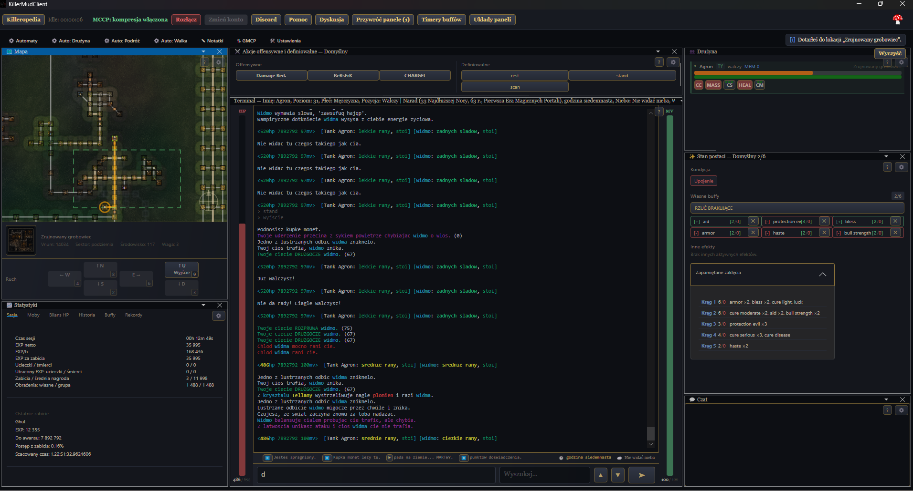
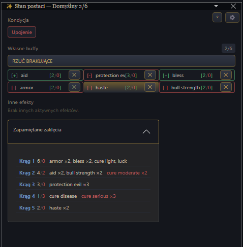
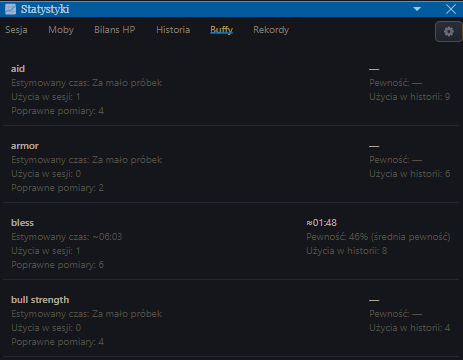
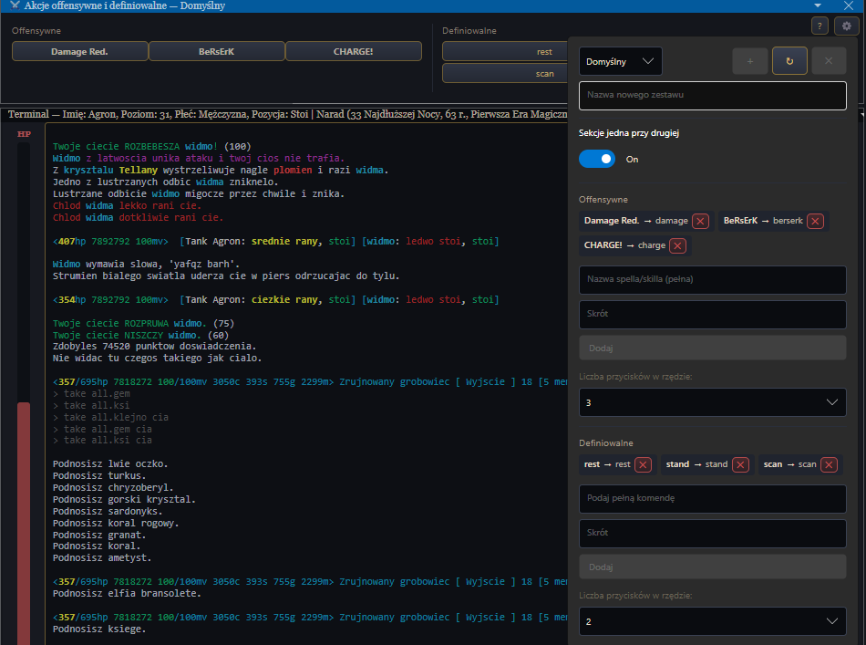
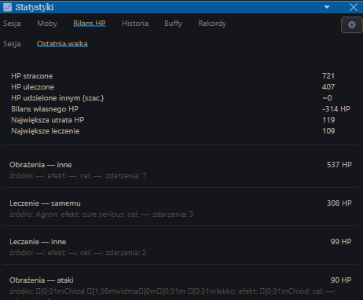

# KillerMudClient

[](https://github.com/tzdziech/killer-mud-client/actions/workflows/ci.yml)
[](https://github.com/tzdziech/killer-mud-client/releases)
[](https://tzdziech.github.io/killer-mud-client/)

**KillerMudClient** to nowoczesny klient MUD tworzony z myślą o [Killer MUD](http://killer-mud.pl).

Łączy klasyczny terminal tekstowy z informacjami GMCP, interaktywną mapą świata, wygodnymi panelami sterowania, automatyzacją oraz rozbudowanymi statystykami postaci i walki.

Celem klienta jest ograniczenie konieczności ręcznego śledzenia wielu informacji i przedstawienie najważniejszych danych o postaci, drużynie, walce i świecie gry w czytelnej formie.

**Strona projektu i pobieranie:**

https://tzdziech.github.io/killer-mud-client/



> **To jest eksperymentalny fork** rozwijany w repozytorium [tzdziech/killer-mud-client](https://github.com/tzdziech/killer-mud-client), wywodzący się z projektu `laszlowaty/killer-mud-client`.
>
> Rozwijane są tutaj dodatkowe funkcje, które nie trafiły jeszcze — lub nie trafią — do głównego repozytorium.

---

# Najważniejsze możliwości

KillerMudClient oferuje między innymi:

- interaktywną mapę świata z automatycznym śledzeniem pozycji,
- automatyczne wyznaczanie trasy i autowalk,
- panel ruchu z obsługą klawiatury numerycznej,
- informacje o postaci i aktywnych efektach pobierane przez GMCP,
- wygodne zarządzanie buffami i zapamiętanymi zaklęciami,
- automatyczne rzucanie brakujących buffów,
- inteligentne przewidywanie czasu zakończenia buffów,
- panel akcji ofensywnych, umiejętności i własnych komend,
- konfigurowalne zestawy przycisków,
- obsługę drużyny i automatyzację gry grupowej,
- statystyki EXP, przeciwników i sesji,
- szczegółowy Bilans HP,
- historię walk i rekordy,
- aliasy, triggery i timery,
- własne układy paneli,
- Killeropedię,
- pomoc kontekstową dostępną bezpośrednio z paneli.

---

# Terminal

Terminal został przygotowany zarówno do krótkich, jak i wielogodzinnych sesji gry.

Obsługuje między innymi:

- kolory ANSI,
- 16 kolorów podstawowych,
- 256 kolorów,
- kolory RGB,
- pogrubienie i podkreślenie,
- kilka schematów kolorystycznych,
- filtrowanie treści,
- zawijanie długich linii,
- rozbudowany scrollback,
- zaznaczanie i kopiowanie tekstu,
- kopiowanie fragmentu terminala jako obrazu.

Dostępne są osobne filtry:

- **Wszystko**,
- **Walka**,
- **Czaty**,
- **System**.

Czcionkę terminala można ustawić niezależnie od pozostałych paneli.

Do aplikacji dołączona jest również czcionka **OpenDyslexic**.

---

# Mapa świata

Klient posiada rozbudowaną, interaktywną mapę świata obejmującą około **25 000 pokoi**.

Pozycja postaci jest automatycznie aktualizowana na podstawie danych GMCP `Room.Info`.

Mapa umożliwia:

- automatyczne śledzenie bieżącej pozycji,
- powiększanie i przesuwanie widoku,
- wybór poziomu lokacji,
- wyświetlanie innych poziomów mapy jako półprzezroczystego podglądu,
- podgląd pozycji członków drużyny,
- wybór miejsca docelowego,
- automatyczne wyznaczanie trasy,
- autowalk do wybranego pokoju.

Pozycje członków drużyny są aktualizowane z GMCP, a lider grupy może być wyróżniony na mapie.

Autowalk potrafi również reagować na niektóre przeszkody w podróży, między innymi:

- niski poziom punktów ruchu,
- potrzebę odpoczynku,
- możliwość użycia `refresh`,
- zamknięte przejścia,
- niestandardowe sposoby otwierania drzwi i bram.

---

# Panel ruchu

Pod mapą znajduje się panel ruchu wykorzystujący aktualne dane z `Room.Info`.

Obsługiwane są kierunki:

**N / S / E / W / U / D**

oraz klawiatura numeryczna:

| Kierunek | Klawisz |
|---|---:|
| Północ | 8 |
| Południe | 2 |
| Zachód | 4 |
| Wschód | 6 |
| Góra | 9 |
| Dół | 3 |

Panel:

- pokazuje tylko rzeczywiście dostępne wyjścia,
- wyświetla nazwy niestandardowych przejść,
- rozpoznaje zamknięte drzwi,
- oznacza je ikoną kłódki,
- współpracuje z mechanizmem otwierania przejść używanym przez autowalk.

Jeśli danego wyjścia nie ma, odpowiedni klawisz numeryczny nie zostanie przypadkowo wpisany do terminala.

Rozmiar przycisków ruchu można zmieniać w ustawieniach.

---

# Stan postaci

Panel **Stan postaci** zbiera w jednym miejscu informacje, które wcześniej były rozdzielone pomiędzy kilka paneli.

Pokazuje między innymi:

- kondycję postaci,
- aktywne efekty,
- własne buffy,
- zapamiętane zaklęcia,
- wykorzystane i dostępne czary w poszczególnych kręgach.



Wyświetlanie zapamiętanych zaklęć można w razie potrzeby ukryć, dzięki czemu panel może zajmować mniej miejsca.

---

# Buffy

System buffów został znacznie rozbudowany.

Każdy skonfigurowany buff pokazuje osobno:

- czy efekt jest aktywny na postaci,
- czy odpowiedni czar jest aktualnie dostępny do rzucenia.

Kolorystyka pozwala szybko rozpoznać stan:

- **zielone obramowanie** — buff jest aktywny,
- **czerwone obramowanie** — buff jest nieaktywny,
- **wyszarzony przycisk** — odpowiedni czar nie jest obecnie dostępny.

Liczba przy buffie informuje również o dostępności zapamiętanych czarów.

Usuwanie buffa z konfiguracji jest osobną akcją i pozostaje dostępne nawet wtedy, gdy sam czar nie może zostać rzucony.

---

## Rzuć brakujące

Przycisk **RZUĆ BRAKUJĄCE** pozwala jednym kliknięciem uzupełnić brakujące buffy.

Klient:

- pomija efekty, które już działają,
- nie próbuje rzucać niezapamiętanych czarów,
- bierze pod uwagę aktualną dostępność czaru,
- rozpoznaje zwykłe i grupowe wersje tego samego efektu.

Jeżeli dostępna jest zarówno wersja pojedyncza, jak i grupowa:

- przy grze solo preferowana jest wersja pojedyncza,
- w drużynie preferowana jest wersja grupowa.

Dzięki temu przygotowanie postaci do walki może wymagać tylko jednego kliknięcia.

---

# Inteligentne timery buffów

KillerMudClient potrafi **uczyć się rzeczywistego czasu działania buffów**.

Nie opiera się wyłącznie na sztywnych wartościach.

Klient obserwuje wcześniejsze użycia danego efektu i na tej podstawie tworzy coraz dokładniejsze oszacowanie jego czasu działania.

Pod uwagę mogą być brane między innymi:

- czas działania podczas walki,
- czas działania poza walką,
- poziom postaci,
- historia wcześniejszych obserwacji.

Jeżeli zgromadzonych danych jest wystarczająco dużo, klient może pokazywać przewidywany czas pozostały do wygaśnięcia buffa.

Przykładowo:

`≈00:24 ●`

Wskaźnik pojawia się tylko wtedy, gdy prognoza osiągnie odpowiednią wiarygodność.

Kolor kropki sygnalizuje poziom pewności estymacji.

Dzięki temu gracz może przygotować się do ponownego rzucenia ważnego efektu jeszcze przed jego zakończeniem.

---

## Statystyki buffów

W panelu **Statystyki → Buffy** można sprawdzić dane zgromadzone przez system estymacji.



Dla poszczególnych buffów można zobaczyć między innymi:

- szacowany czas działania,
- przewidywany pozostały czas,
- poziom pewności,
- liczbę prawidłowych pomiarów,
- liczbę użyć w bieżącej sesji,
- liczbę użyć zapisaną w historii.

Jeżeli próbek jest jeszcze za mało, klient informuje, że system nadal się uczy.

---

# Akcje ofensywne i definiowalne

Panel **Akcje ofensywne i definiowalne** pełni rolę szybkiego paska działań.

Można umieścić w nim:

- czary ofensywne,
- umiejętności,
- własne polecenia,
- często używane komendy pomocnicze.



Klient potrafi rozpoznawać czary i umiejętności znane z Killeropedii, dzięki czemu przyciski mogą dodatkowo pokazywać:

- liczbę dostępnych zapamiętanych czarów,
- aktualny cooldown umiejętności.

Liczbę przycisków w jednym rzędzie można konfigurować.

Sekcje ofensywna i definiowalna mogą być ustawione obok siebie lub jedna pod drugą.

---

# Zestawy konfiguracji

Wybrane panele obsługują niezależne **zestawy** konfiguracji.

Dotyczy to między innymi:

- **Stanu postaci / buffów**,
- **Drużyny**,
- **Akcji ofensywnych i definiowalnych**.

Można przygotować osobne zestawy przykładowo:

- do EXP,
- do gry solo,
- do drużyny,
- do leczenia,
- do konkretnych przeciwników,
- do podróżowania.

Z poziomu ustawień panelu można:

- wybrać zestaw,
- utworzyć nowy,
- zapisać bieżącą konfigurację,
- usunąć zestaw.

Aktywny zestaw jest widoczny w tytule panelu.

Po jego zmianie zawartość przycisków, dostępność czarów i cooldowny są odświeżane natychmiast.

---

# Drużyna

Panel **Drużyna** prezentuje skład oraz stan grupy na podstawie GMCP.

Pozwala szybko sprawdzić informacje o poszczególnych członkach oraz przygotować własne skróty do czarów i akcji grupowych.

Przy czarach dostępna liczba zapamiętań może być przedstawiana za pomocą niewielkich kropek nad nazwą przycisku.

Dzięki temu można od razu ocenić, ile razy dany czar jest jeszcze dostępny.

---

# Statystyki

Panel **Statystyki** automatycznie zbiera dane osobno dla każdej postaci.

Dostępne są zakładki:

- **Sesja**,
- **Moby**,
- **Bilans HP**,
- **Historia**,
- **Buffy**,
- **Rekordy**.

---

## Statystyki sesji

Podstawowe informacje obejmują między innymi:

- czas sesji,
- EXP netto,
- zdobyty EXP,
- EXP za zabicia,
- ucieczki,
- śmierci,
- utracony EXP,
- liczbę pokonanych przeciwników,
- przybliżone obrażenia własne i grupowe,
- pieniądze zdobyte, wydane oraz bilans sesji.

Dostępne są również informacje o ostatnio pokonanym przeciwniku.

Przychody obejmują łupy z ciał i sprzedaż, a wydatki — zakupy, naprawy oraz
opłaty za naukę. Wpłaty i wypłaty bankowe są pomijane. Kwoty są przeliczane
według kursu `1s = 60c`, `1g = 15s`, `1m = 12g`.

Statystyki są przypisane do faktycznej postaci rozpoznanej przez GMCP, a nie tylko do profilu połączenia.

---

# Moby i historia walk

Klient potrafi prowadzić historię walk z przeciwnikami.

Może zapamiętywać między innymi:

- nazwy pokonanych mobów,
- zdobywany EXP,
- datę ostatniego zabicia,
- wyniki wcześniejszych spotkań,
- rekordy.

Do identyfikowania przeciwników wykorzystywane są zarówno informacje GMCP, jak i wydarzenia widoczne w terminalu.

Jeżeli sytuacja jest niejednoznaczna, klient nie przypisuje wyniku na siłę do przypadkowego przeciwnika.

---

# Bilans HP

Zakładka **Bilans HP** pozwala szczegółowo przeanalizować przebieg walki.



Dostępne są dwa widoki:

- **Sesja**,
- **Ostatnia walka**.

Klient pokazuje między innymi:

- HP stracone,
- HP uleczone,
- szacowane leczenie udzielone innym,
- bilans własnego HP,
- największą utratę HP,
- największe leczenie,
- przybliżone obrażenia zadane przez każdego członka grupy w ostatniej walce.

Zdarzenia są dodatkowo klasyfikowane według rodzaju.

Obrażenia mogą być podzielone na:

- ataki,
- czary,
- efekty okresowe,
- inne źródła.

Leczenie może być podzielone na:

- leczenie samego siebie,
- leczenie otrzymane,
- leczenie okresowe,
- regenerację podczas odpoczynku,
- leczenie innych postaci.

Leczenie udzielone innym oznaczone jest symbolem `~`, ponieważ jest wartością szacowaną na podstawie dostępnych informacji z gry.

---

# Rekordy

Panel statystyk może również zapamiętywać rekordowe wyniki, np.:

- największe otrzymane obrażenie,
- największe leczenie,
- najlepsze wyniki związane z EXP i walką.

Dzięki temu można obserwować rozwój postaci także w dłuższym okresie.

---

# Automatyzacja

KillerMudClient posiada własny system automatyzacji.

## Aliasy

Aliasy pozwalają zastąpić długie polecenia krótszymi komendami.

## Triggery

Triggery reagują na określony tekst pojawiający się w terminalu i mogą automatycznie wykonywać skonfigurowane akcje.

## Timery

Timery pozwalają cyklicznie wykonywać polecenia.

Aktywne timery mogą wyświetlać odliczanie bezpośrednio przy prawej krawędzi terminala.

---

# Foldery i organizacja

Aliasy, triggery, timery, zapisane cele autowalk oraz notatki można organizować w zagnieżdżonych folderach.

Foldery obsługują między innymi:

- przeciąganie elementów metodą drag & drop,
- grupowanie,
- włączanie i wyłączanie,
- konfiguracje globalne,
- grupowe usuwanie.

Aliasy, triggery i timery oraz całe drzewa folderów można również importować i eksportować.

---

# Automatyzacja drużyny

Klient posiada funkcje wspierające grę grupową.

## Autoassist

Może automatycznie wysłać komendę asysty, gdy GMCP wskaże walczącego członka drużyny w tym samym pokoju.

Po rozpoczęciu asysty można skonfigurować dodatkowe komendy.

## Ordery

Klient może reagować na rozkazy wysyłane przez członków aktualnej grupy.

Nadawca jest weryfikowany na podstawie składu drużyny z GMCP.

## Sterowanie drużyną

Dostępne są również funkcje związane z:

- odpoczynkiem,
- wstawaniem,
- odnawianiem punktów ruchu,
- rzucaniem `refresh` na członków drużyny.

---

# Killeropedia

Przycisk **Killeropedia** otwiera wbudowaną bazę wiedzy.

## Nauczyciele

Zakładka nauczycieli pozwala wyszukiwać według:

- nazwy,
- umiejętności,
- klasy,
- krainy,
- vnum.

Jeżeli lokalizacja nauczyciela jest znana, przycisk **Pokaż na mapie** zaznacza odpowiedni pokój i wyznacza trasę.

Nie uruchamia przy tym automatycznie autowalka.

## Księgi magiczne

Katalog ksiąg pozwala wyszukiwać według:

- nazwy księgi,
- zaklęcia,
- profesji,
- miejsca występowania,
- vnum.

---

# Pomoc kontekstowa

Każdy główny panel posiada przycisk **?**.

Pomoc opisuje:

- przeznaczenie panelu,
- znaczenie poszczególnych informacji,
- działanie przycisków,
- ustawienia,
- skróty klawiaturowe.

Opisy są również dostępne centralnie w:

**Pomoc → Panele**

Dzięki temu większość funkcji klienta można poznać bez opuszczania aplikacji i bez szukania zewnętrznej instrukcji.

---

# Konfigurowalny interfejs

Panele można rozmieszczać zgodnie z własnymi preferencjami.

Można tworzyć własne układy paneli, a następnie:

- przełączać się między nimi,
- aktualizować istniejący układ,
- usuwać własne układy,
- przywrócić domyślne rozmieszczenie.

Pozwala to przygotować przykładowo osobny interfejs:

- do eksploracji,
- do EXP,
- do walki,
- do gry drużynowej.

---

# Notatki i czat

Klient posiada również:

- panel własnych notatek,
- osobny panel czatu,
- podgląd surowych pakietów GMCP.

Panele można dokować i rozmieszczać razem z pozostałymi elementami interfejsu.

---

# Profile i logowanie

Każdy profil może posiadać własne:

- dane połączenia,
- host,
- port,
- login,
- lokalną nazwę konta.

Po wybraniu zapisanego profilu klient może automatycznie połączyć się z serwerem i zalogować.

Na Windows zapisane hasła są szyfrowane za pomocą systemowego mechanizmu DPAPI i nie są przechowywane jako zwykły tekst.

---

# Kopia ustawień

Panel **Ustawienia** pozwala wyeksportować kompletną konfigurację programu do archiwum ZIP.

Kopia może obejmować między innymi:

- profile,
- ustawienia,
- automatyzację,
- układy paneli,
- dane klienta.

Kopię można później zaimportować i odtworzyć na innym komputerze lub po ponownej instalacji.


---

# Pierwsze uruchomienie

Po uruchomieniu aplikacji:

1. utwórz nowe konto lub wybierz istniejące,
2. wpisz adres serwera,
3. ustaw port,
4. wpisz login,
5. opcjonalnie zapisz hasło,
6. połącz się z serwerem.

Każde konto posiada własną konfigurację połączenia.

---

# Komendy klienta

Wybrane komendy dostępne bezpośrednio w terminalu:

```text
/idz
/idz <cel>
/idz_dodaj <nazwa>
/stop
/recast
/reconnect
/capture start
/capture stop
/expstats off
```

Pełna lista dostępna jest z poziomu przycisku **Pomoc**.

```

# Dla deweloperów

KillerMudClient jest napisany w **C#** i wykorzystuje **Avalonia UI**.

## Wymagania

- .NET 10 SDK

Opcjonalnie:

- Visual Studio,
- VS Code,
- C# Dev Kit,
- Avalonia for VS Code.

---

## Budowanie

```bash
dotnet restore
dotnet build
dotnet test
dotnet run --project src/MudClient.App
```

Na Windows można również użyć:

```powershell
./verify.ps1
```

lub:

```text
verify.bat
```

Skrypt wykonuje pełną walidację projektu i uruchamia projekty testowe.

---

# Publikowanie

Wersja aplikacji odczytywana jest z:

```text
Directory.Build.props
```

## Windows

```text
publish.bat release
```

lub:

```text
publish.bat beta
```

Każde uruchomienie tworzy dwa samodzielne pliki `win-x64` w katalogu
`publish\win-x64\<beta|release>`: wariant User o standardowej nazwie oraz wariant
Admin z sufiksem `-admin`. Wariant Admin udostępnia panel Farma i automatycznie
rozpoczyna przechwytywanie sesji Terminal + GMCP po automatycznym logowaniu.

Lokalnie uruchomisz wariant User przez `./run.ps1` lub `run.bat`. Dla wariantu
Admin użyj `./run.ps1 -Configuration Admin` albo `run.bat Admin`.

## Linux / macOS

```bash
./publish.sh release
```

lub:

```bash
./publish.sh beta
```

Dostępny jest również skrypt cross-kompilacji macOS z Windows.

---

# Struktura projektu

```text
src/
├── MudClient.Core/       # Telnet, GMCP, TCP, mapa, aliasy, triggery, timery
└── MudClient.App/        # Avalonia, panele, widoki i terminal

tests/
├── MudClient.Core.Tests/
└── MudClient.App.Tests/

tools/
├── MudClient.MapBackdropGenerator/
└── MudClient.MapImageCalibrator/

docs/
└── strona projektu i materiały
```

Warstwa `MudClient.Core` nie zależy od Avalonia, dzięki czemu większość mechaniki może być testowana bez uruchamiania GUI.

---


# Dane aplikacji

Dane użytkownika przechowywane są standardowo w:

```text
%AppData%\KillerMudClient
```

Ustawienia i dane są zapisywane lokalnie. Kopię konfiguracji można wykonać w panelu **Ustawienia**.

---

# Współtworzenie projektu

Zasady pracy, model gałęzi i proces wydawania opisuje [CONTRIBUTING.md](CONTRIBUTING.md).

Przed zmianami w kodzie przeczytaj [AGENTS.md](AGENTS.md).
